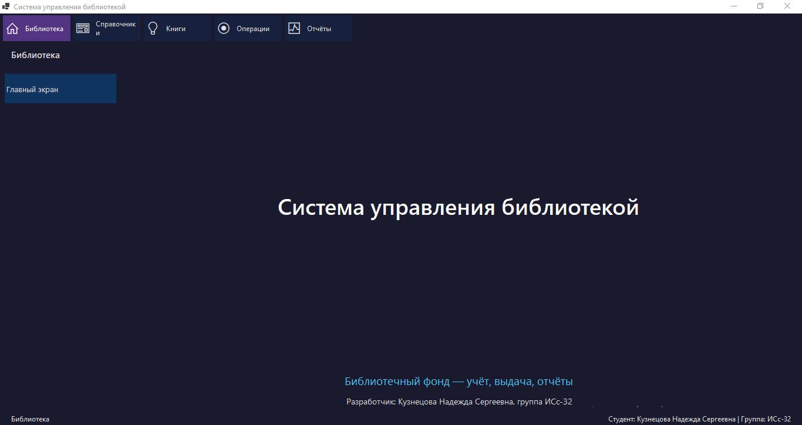
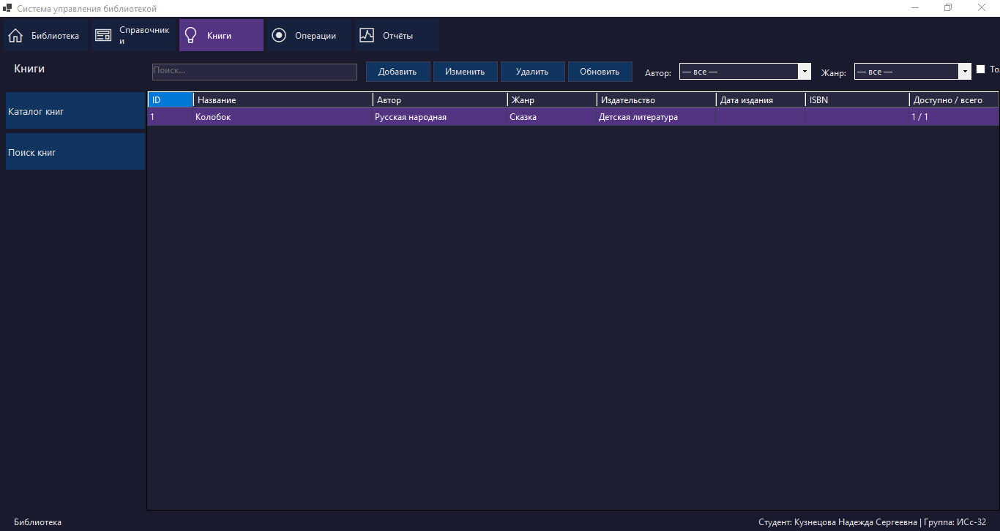
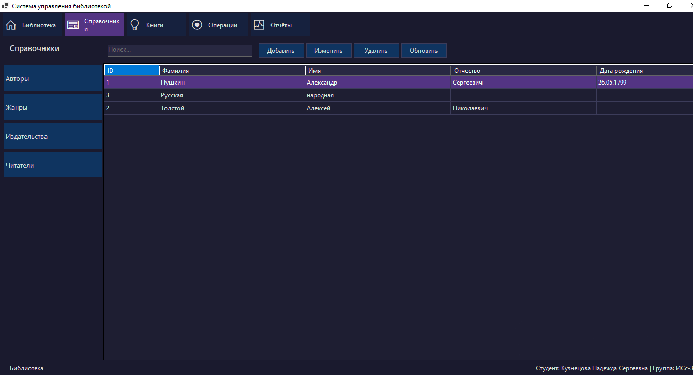
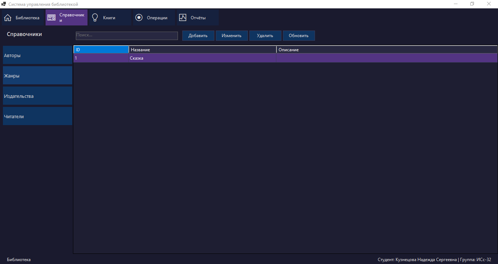
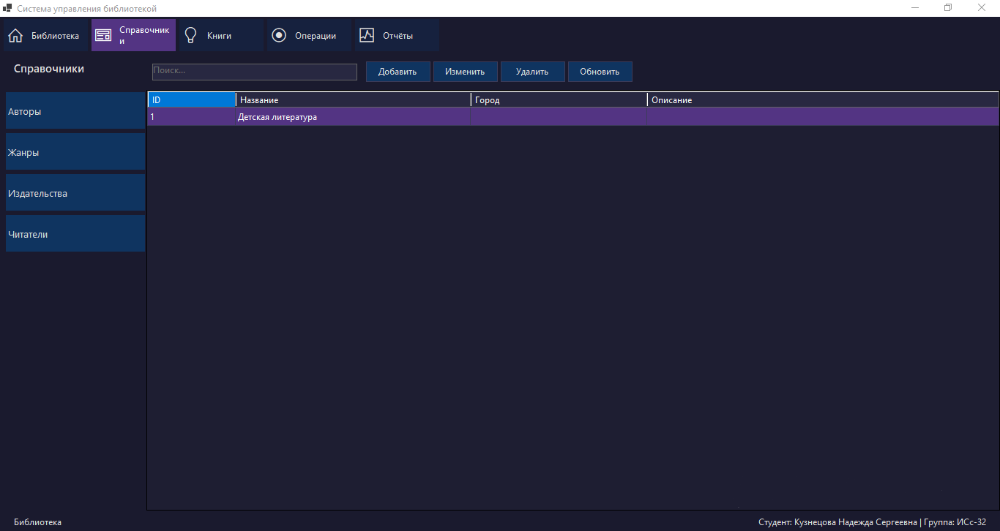
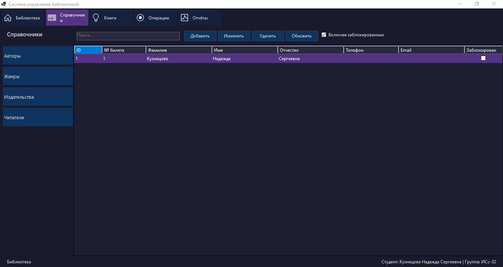
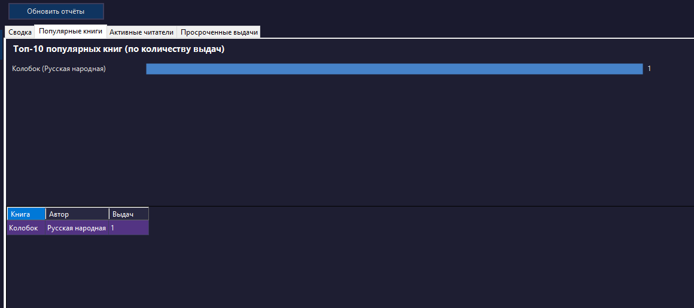

# LibraryManagement

Система управления библиотекой - десктопное приложение на C# / .NET 10 / WinForms с многослойной архитектурой и Entity Framework Core (SQLite).

## О проекте

LibraryManagement - производственно-практический проект автоматизации работы библиотеки: учёт книг, читателей, авторов, жанров, издательств, выдача и возврат книг, формирование отчётов.

### Возможности проекта

- Управление каталогом книг (добавление, редактирование, удаление, поиск)
- Учёт читателей и контактных данных
- Учёт авторов, жанров и издательств
- Выдача и возврат книг с отслеживанием статуса
- Отчёты и аналитика (графики выдач, статистика)
- Валидация входных данных через FluentValidation
- Локальное хранилище SQLite - не требует отдельного сервера БД
- Тёмная индиго-тема интерфейса

### Сборка и запуск

```powershell
git clone https://github.com/NadKuznetsova/Practice.git
cd Practice

dotnet restore
dotnet build
dotnet run --project src/LibraryManagement.WinForms
```
## Скриншоты

### Главное меню



### Каталог книг



### Авторы



### Жанры



### Издательства



### Читатели



### Топ популярных книг


